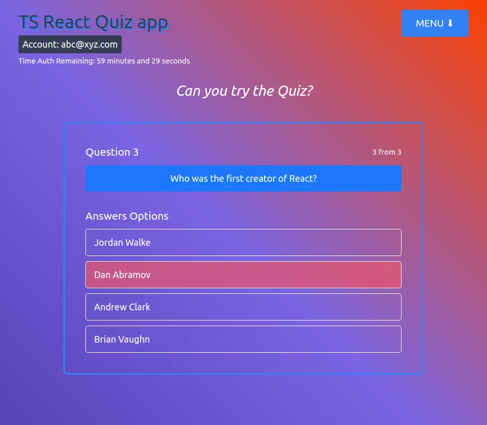

# TS-React-Quiz-app

> TypeScript React training-project

## Description

Quiz app with possibility of creating new Questions, if User is authorized

## Preview

## Tech Stack

- TypeScript
- React, hooks
- React Router
- Redux-Toolkit, RTK-Query
- Firebase (Database, Auth with REST)
- React-testing-library (Unit & Integration tests with mocks)
- Auto deploy on Render

### TODO

- add more tests
- add e2e tests with Cypress
- move more logic into Redux for using later
- add Firebase SDK?
- add new features like
  - different quizzes by topic?
  - custom user data?
  - statistics?
- protect Firebase DB better
